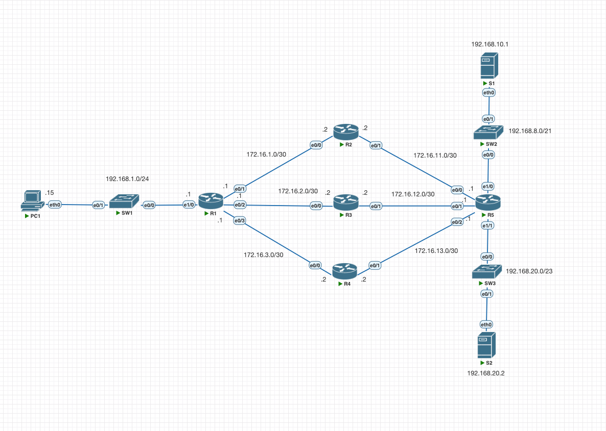
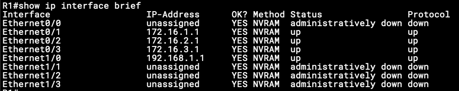
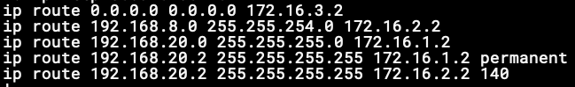

# Config Lab: Static Routing - Practice Exam Question 1

Esse lab é baseado em uma questão que vi em um simulado no guia oficial da Cisco, eu apenas alterei os endereços e rotas para praticar os conceitos.

Esse lab tem como objetivo praticar conceitos de endereçamento IPv4, rotas estáticas e como os roteadores tomam decisão ao encaminhar pacotes.

## Por que prever o comportamento da rede importa?

Esse laboratório pode parecer simples à primeira vista, afinal, são só alguns roteadores e rotas estáticas. Mas aqui está o ponto: o CCNA é o primeiro contato sério com Engenharia de Redes, e uma das habilidades que precisamos desenvolver desde já é **prever o comportamento** dos equipamentos, dos protocolos e da rede como um todo.

Nas provas e nos labs, não basta “configurar e torcer para funcionar”. É preciso conseguir, antes de rodar um `ping` ou um `traceroute`, imaginar por qual caminho os pacotes vão trafegar, em qual roteador a decisão de encaminhamento será tomada e qual será o resultado. Essa capacidade de **raciocinar sobre a rede**, e não só decorar comandos, é o que separa quem entende de quem apenas repete. Por isso, neste lab, a pergunta central é: com base na topologia e nas rotas configuradas, qual será o comportamento esperado?



## Configuração do Lab

Os endereços IP foram aplicados conforme exibido na topologia, observe atentamente o status das interfaces do roteador R1 ao executarmos o comando:

```cisco
show ip interface brief
```



Foram aplicadas as rotas conforme abaixo:



Com base nas informações fornecidas, imagine que o link entre R1 e R2 falhe. Ao executar um ping do PC1 aos servidores, qual será o comportamento esperado?

1. Pacotes enviados ao servidor S1 vão passar pelo R1, R3 e adiante
2. Pacotes enviados ao servidor S1 vão passar pelo R1, R4 e adiante
3. Pacotes enviados ao servidor S1 vão ser descartados
4. Pacotes enviados ao servidor S2 vão passar pelo R1, R3 e adiante
5. Pacotes enviados ao servidor S2 vão passar pelo R1, R4 e adiante
6. Pacotes enviados ao servidor S2 vão ser descartados

### Resultado

Para verificar a resposta, acesse o R1 e aplique os comandos abaixo (a interface Ethernet 0/1 simula a falha do link com o R2):

```cisco
enable
configure terminal
interface ethernet 0/1
shutdown
```

Em seguida, acesse o PC1 e execute os comandos de traceroute para cada servidor:

```cisco
trace 192.168.10.1
```

```cisco
trace 192.168.20.2
```

Observe a saída dos comandos e compare com a sua resposta. Quer discutir a solução nos comentários? O arquivo do laboratório está disponível nos recursos deste lab — basta clicar [aqui](./assets/lab/08_config-lab_ipv4-static-routes-practice-exam-question-1.zip) para baixar.
